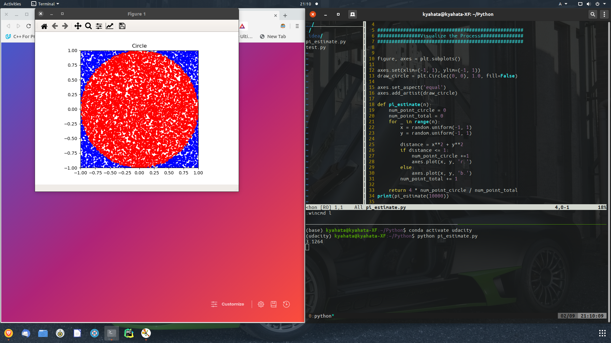

# Estimate_Pi

This is the code which estimates PI(3.1415....) using basic Math

EQUATION

If r is the radius of the circle and the circle is in the rectangle with its side 2r, 
```
  (pi * r **2) / (2r) ** 2 = num of points in circle / num of points in total
  
  pi = 4 * num of points in circle / num of points in total
```


